# GF

## 源码

StartForce只有dll

替换dll一定要用最新的版本，以免有问题

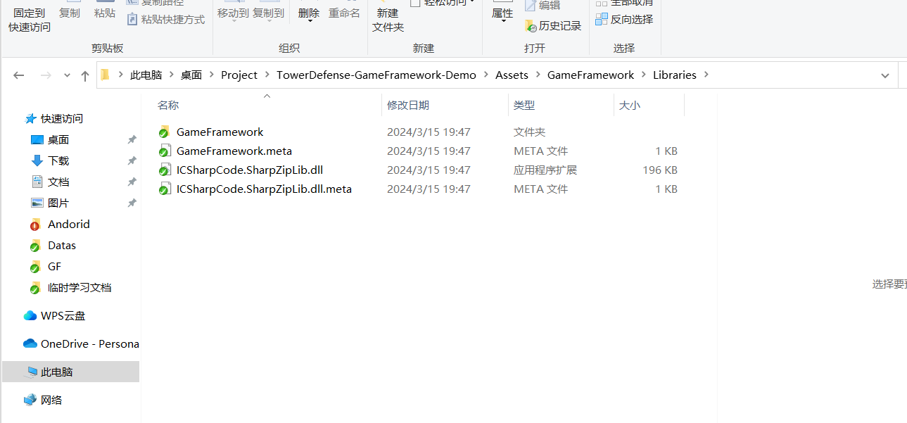

## 版本号处理

/Library/Frameworks/Python.framework/Versions/3.12/bin/python3

**PATH="/Library/Frameworks/Python.framework/Versions/3.12/bin:${PATH}"
export PATH**
alias python="/Library/Frameworks/Python.framework/Versions/3.12/bin/python3"

## 接入HybridCLR

https://blog.csdn.net/final5788/article/details/125965514

### 第一次打包注意事项

要先Install一下，打包机那边 

接入划分程序集后Procedure就找不到了

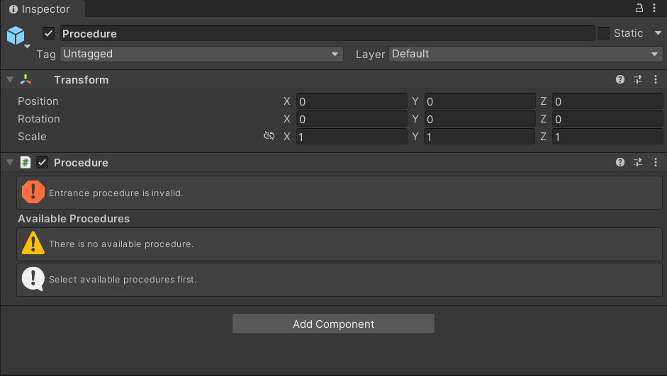

### 对流程改造

新增ProcedureCodeInit流程

替换ProcedurePreLoad，在它之前

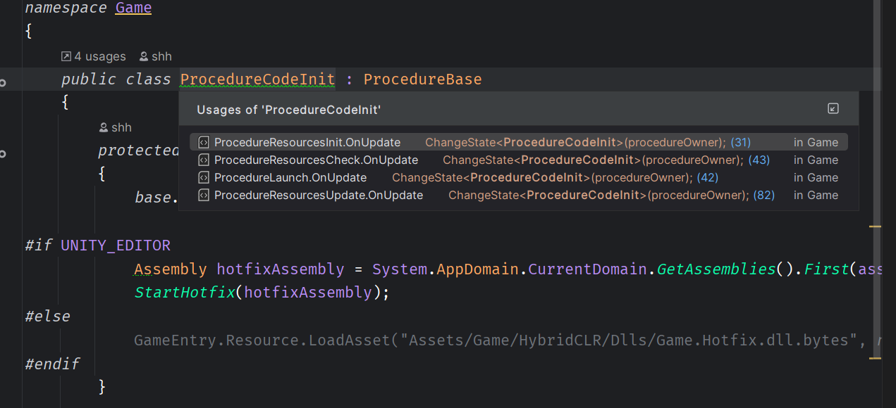

### 如何使用GameEntry

分为GFBuildIn和GF，后者继承前者

### Procedure找不到

在这里加入程序集名称，默认通过搜索这些程序集来找的

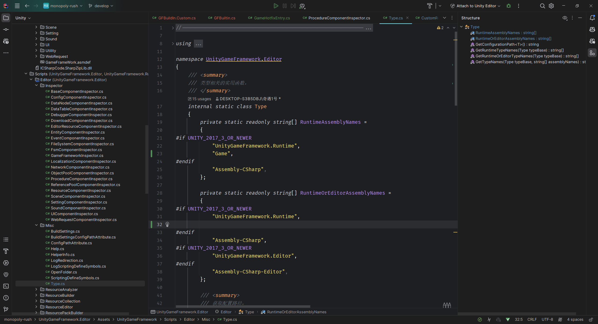


## 单机（Package）模式

```cs
m_ResourceManager.m_ResourceHelper.LoadBytes(Utility.Path.GetRemotePath(Path.Combine(m_ResourceManager.m_ReadOnlyPath, RemoteVersionListFileName)), new LoadBytesCallbacks(OnLoadPackageVersionListSuccess, OnLoadPackageVersionListFailure), null);
```

## 资源更新流程

### 默认的版本号是不可更改的

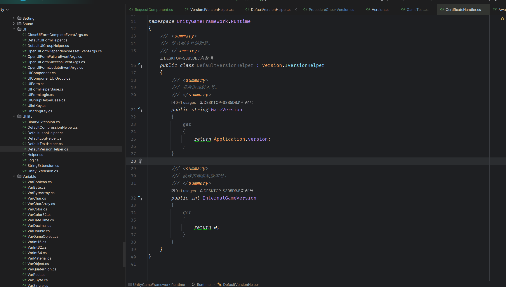


### Resource的三种Read-Write Path Type

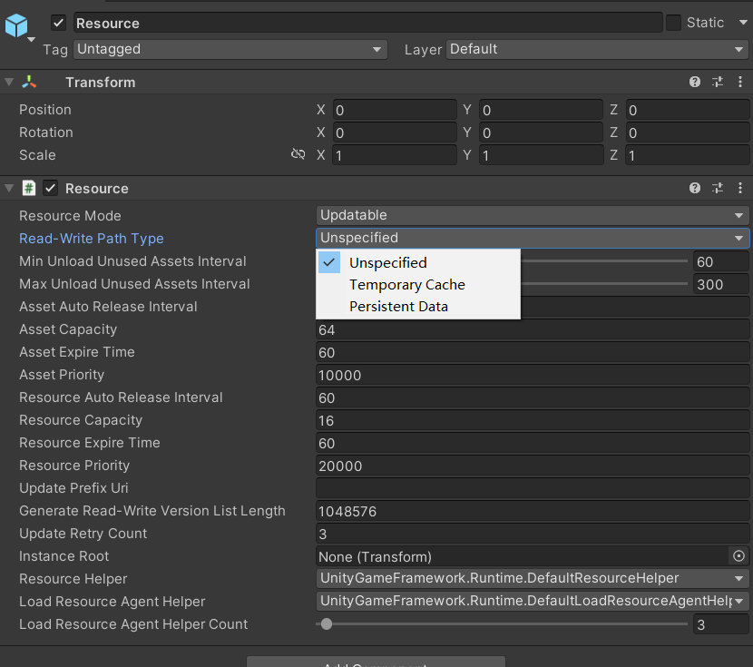

ResourceComponent Start方法中初始化

```css
m_ResourceManager.SetReadOnlyPath(Application.streamingAssetsPath);
if (m_ReadWritePathType == ReadWritePathType.TemporaryCache)
{
    m_ResourceManager.SetReadWritePath(Application.temporaryCachePath);
}
else
{
    if (m_ReadWritePathType == ReadWritePathType.Unspecified)
    {
        m_ReadWritePathType = ReadWritePathType.PersistentData;
    }

    m_ResourceManager.SetReadWritePath(Application.persistentDataPath);
}
```

```css
Debug.Log(Application.temporaryCachePath);
Debug.Log(Application.persistentDataPath);
```

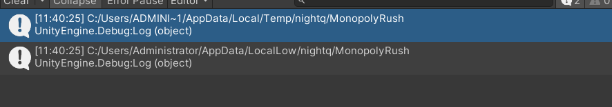

###  检查版本资源列表

这个方法会在ProcedureCheckVersion中调用

```cs
/// <summary>
/// 检查版本资源列表。
/// </summary>
/// <param name="latestInternalResourceVersion">最新的内部资源版本号。</param>
/// <returns>检查版本资源列表结果。</returns>
public CheckVersionListResult CheckVersionList(int latestInternalResourceVersion)
{
    if (string.IsNullOrEmpty(m_ResourceManager.m_ReadWritePath))
    {
        throw new GameFrameworkException("Read-write path is invalid.");
    }
	//m_ReadWritePath就是temporaryCachePath或者persistentDataPath
    //RemoteVersionListFileName是"GameFrameworkVersion.dat
    string versionListFileName = Utility.Path.GetRegularPath(Path.Combine(m_ResourceManager.m_ReadWritePath, RemoteVersionListFileName));
    if (!File.Exists(versionListFileName))
    {
        return CheckVersionListResult.NeedUpdate;
    }

    int internalResourceVersion = 0;
    //获取GameFrameworkVersion.dat中的internalResourceVersion
    FileStream fileStream = null;
    try
    {
        fileStream = new FileStream(versionListFileName, FileMode.Open, FileAccess.Read);
        object internalResourceVersionObject = null;
        if (!m_ResourceManager.m_UpdatableVersionListSerializer.TryGetValue(fileStream, "InternalResourceVersion", out internalResourceVersionObject))
        {
            return CheckVersionListResult.NeedUpdate;
        }

        internalResourceVersion = (int)internalResourceVersionObject;
    }
    catch
    {
        return CheckVersionListResult.NeedUpdate;
    }
    finally
    {
        if (fileStream != null)
        {
            fileStream.Dispose();
            fileStream = null;
        }
    }
//只要与服务器上的不一致就更新
    if (internalResourceVersion != latestInternalResourceVersion)
    {
        return CheckVersionListResult.NeedUpdate;
    }

    return CheckVersionListResult.Updated;
}
```

### 更新版本

从服务器上下载GameFrameworkVersion.dat

```cs
/// <summary>
/// 更新版本资源列表。
/// </summary>
/// <param name="versionListLength">版本资源列表大小。</param>
/// <param name="versionListHashCode">版本资源列表哈希值。</param>
/// <param name="versionListCompressedLength">版本资源列表压缩后大小。</param>
/// <param name="versionListCompressedHashCode">版本资源列表压缩后哈希值。</param>
public void UpdateVersionList(int versionListLength, int versionListHashCode, int versionListCompressedLength, int versionListCompressedHashCode)
{
    if (m_DownloadManager == null)
    {
        throw new GameFrameworkException("You must set download manager first.");
    }

    m_VersionListLength = versionListLength;
    m_VersionListHashCode = versionListHashCode;
    m_VersionListCompressedLength = versionListCompressedLength;
    m_VersionListCompressedHashCode = versionListCompressedHashCode;
    string localVersionListFilePath = Utility.Path.GetRegularPath(Path.Combine(m_ResourceManager.m_ReadWritePath, RemoteVersionListFileName));
    int dotPosition = RemoteVersionListFileName.LastIndexOf('.');
    string latestVersionListFullNameWithCrc32 = Utility.Text.Format("{0}.{2:x8}.{1}", RemoteVersionListFileName.Substring(0, dotPosition), RemoteVersionListFileName.Substring(dotPosition + 1), m_VersionListHashCode);
    m_DownloadManager.AddDownload(localVersionListFilePath, Utility.Path.GetRemotePath(Path.Combine(m_ResourceManager.m_UpdatePrefixUri, latestVersionListFullNameWithCrc32)), this);
}
```

### 检查资源

```csharp
/// <summary>
/// 检查资源。
/// </summary>
/// <param name="currentVariant">当前使用的变体。</param>
/// <param name="ignoreOtherVariant">是否忽略处理其它变体的资源，若不忽略，将会移除其它变体的资源。</param>
public void CheckResources(string currentVariant, bool ignoreOtherVariant)
{
    if (m_ResourceManager.m_ResourceHelper == null)
    {
        throw new GameFrameworkException("Resource helper is invalid.");
    }

    if (string.IsNullOrEmpty(m_ResourceManager.m_ReadOnlyPath))
    {
        throw new GameFrameworkException("Read-only path is invalid.");
    }

    if (string.IsNullOrEmpty(m_ResourceManager.m_ReadWritePath))
    {
        throw new GameFrameworkException("Read-write path is invalid.");
    }

    m_CurrentVariant = currentVariant;
    m_IgnoreOtherVariant = ignoreOtherVariant;
    m_ResourceManager.m_ResourceHelper.LoadBytes(Utility.Path.GetRemotePath(Path.Combine(m_ResourceManager.m_ReadWritePath, RemoteVersionListFileName)), new LoadBytesCallbacks(OnLoadUpdatableVersionListSuccess, OnLoadUpdatableVersionListFailure), null);
    m_ResourceManager.m_ResourceHelper.LoadBytes(Utility.Path.GetRemotePath(Path.Combine(m_ResourceManager.m_ReadOnlyPath, LocalVersionListFileName)), new LoadBytesCallbacks(OnLoadReadOnlyVersionListSuccess, OnLoadReadOnlyVersionListFailure), null);
    m_ResourceManager.m_ResourceHelper.LoadBytes(Utility.Path.GetRemotePath(Path.Combine(m_ResourceManager.m_ReadWritePath, LocalVersionListFileName)), new LoadBytesCallbacks(OnLoadReadWriteVersionListSuccess, OnLoadReadWriteVersionListFailure), null);
}
```

LoadBytes是用DefaultResourceHelper，用UnityWebRequest请求服务器上的文件


### 加载成功后

```cs
private void OnLoadUpdatableVersionListSuccess(string fileUri, byte[] bytes, float duration, object userData)
{
    if (m_UpdatableVersionListReady)
    {
        throw new GameFrameworkException("Updatable version list has been parsed.");
    }

    MemoryStream memoryStream = null;
    try
    {
        memoryStream = new MemoryStream(bytes, false);
        UpdatableVersionList versionList = m_ResourceManager.m_UpdatableVersionListSerializer.Deserialize(memoryStream);
        if (!versionList.IsValid)
        {
            throw new GameFrameworkException("Deserialize updatable version list failure.");
        }

        UpdatableVersionList.Asset[] assets = versionList.GetAssets();
        UpdatableVersionList.Resource[] resources = versionList.GetResources();
        UpdatableVersionList.FileSystem[] fileSystems = versionList.GetFileSystems();
        UpdatableVersionList.ResourceGroup[] resourceGroups = versionList.GetResourceGroups();
        m_ResourceManager.m_ApplicableGameVersion = versionList.ApplicableGameVersion;
        m_ResourceManager.m_InternalResourceVersion = versionList.InternalResourceVersion;
        m_ResourceManager.m_AssetInfos = new Dictionary<string, AssetInfo>(assets.Length, StringComparer.Ordinal);
        m_ResourceManager.m_ResourceInfos = new Dictionary<ResourceName, ResourceInfo>(resources.Length, new ResourceNameComparer());
        m_ResourceManager.m_ReadWriteResourceInfos = new SortedDictionary<ResourceName, ReadWriteResourceInfo>(new ResourceNameComparer());
        ResourceGroup defaultResourceGroup = m_ResourceManager.GetOrAddResourceGroup(string.Empty);

        foreach (UpdatableVersionList.FileSystem fileSystem in fileSystems)
        {
            int[] resourceIndexes = fileSystem.GetResourceIndexes();
            foreach (int resourceIndex in resourceIndexes)
            {
                UpdatableVersionList.Resource resource = resources[resourceIndex];
                if (resource.Variant != null && resource.Variant != m_CurrentVariant)
                {
                    continue;
                }

                SetCachedFileSystemName(new ResourceName(resource.Name, resource.Variant, resource.Extension), fileSystem.Name);
            }
        }

        foreach (UpdatableVersionList.Resource resource in resources)
        {
            if (resource.Variant != null && resource.Variant != m_CurrentVariant)
            {
                continue;
            }

            ResourceName resourceName = new ResourceName(resource.Name, resource.Variant, resource.Extension);
            int[] assetIndexes = resource.GetAssetIndexes();
            foreach (int assetIndex in assetIndexes)
            {
                UpdatableVersionList.Asset asset = assets[assetIndex];
                int[] dependencyAssetIndexes = asset.GetDependencyAssetIndexes();
                int index = 0;
                string[] dependencyAssetNames = new string[dependencyAssetIndexes.Length];
                foreach (int dependencyAssetIndex in dependencyAssetIndexes)
                {
                    dependencyAssetNames[index++] = assets[dependencyAssetIndex].Name;
                }

                m_ResourceManager.m_AssetInfos.Add(asset.Name, new AssetInfo(asset.Name, resourceName, dependencyAssetNames));
            }

            SetVersionInfo(resourceName, (LoadType)resource.LoadType, resource.Length, resource.HashCode, resource.CompressedLength, resource.CompressedHashCode);
            defaultResourceGroup.AddResource(resourceName, resource.Length, resource.CompressedLength);
        }

        foreach (UpdatableVersionList.ResourceGroup resourceGroup in resourceGroups)
        {
            ResourceGroup group = m_ResourceManager.GetOrAddResourceGroup(resourceGroup.Name);
            int[] resourceIndexes = resourceGroup.GetResourceIndexes();
            foreach (int resourceIndex in resourceIndexes)
            {
                UpdatableVersionList.Resource resource = resources[resourceIndex];
                if (resource.Variant != null && resource.Variant != m_CurrentVariant)
                {
                    continue;
                }

                group.AddResource(new ResourceName(resource.Name, resource.Variant, resource.Extension), resource.Length, resource.CompressedLength);
            }
        }

        m_UpdatableVersionListReady = true;
        RefreshCheckInfoStatus();
    }
    catch (Exception exception)
    {
        if (exception is GameFrameworkException)
        {
            throw;
        }

        throw new GameFrameworkException(Utility.Text.Format("Parse updatable version list exception '{0}'.", exception), exception);
    }
    finally
    {
        if (memoryStream != null)
        {
            memoryStream.Dispose();
            memoryStream = null;
        }
    }
}
```

### 更新资源

这些方法都在ResourceManager里

update方法里下载资源

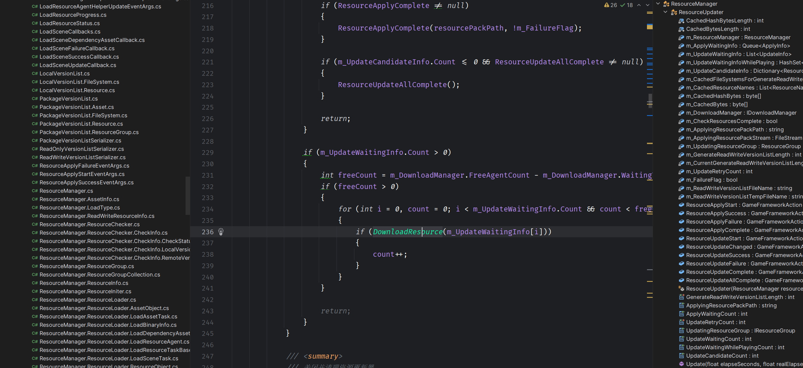

```cs
private bool DownloadResource(UpdateInfo updateInfo)
{
    if (updateInfo.Downloading)
    {
        return false;
    }

    updateInfo.Downloading = true;
    string resourceFullNameWithCrc32 = updateInfo.ResourceName.Variant != null ? Utility.Text.Format("{0}.{1}.{2:x8}.{3}", updateInfo.ResourceName.Name, updateInfo.ResourceName.Variant, updateInfo.HashCode, DefaultExtension) : Utility.Text.Format("{0}.{1:x8}.{2}", updateInfo.ResourceName.Name, updateInfo.HashCode, DefaultExtension);
    m_DownloadManager.AddDownload(updateInfo.ResourcePath, Utility.Path.GetRemotePath(Path.Combine(m_ResourceManager.m_UpdatePrefixUri, resourceFullNameWithCrc32)), updateInfo);
    return true;
}
```

### GameFrameworkVersion.dat文件

包含了一些校验信息

## NetWork

http://www.benmutou.com/archives/2630

## WebRequst

### UnityWebRequst的坑

https://blog.csdn.net/qq_46044366/article/details/124099596

Json作为参数的时候，要设置www.SetRequestHeader("Content-Type", "application/json;charset=utf-8");   

因为默认是 **Content-Type 默认是 application/x-www-form-urlencoded**

默认如果userData为空的话是发起Get请求

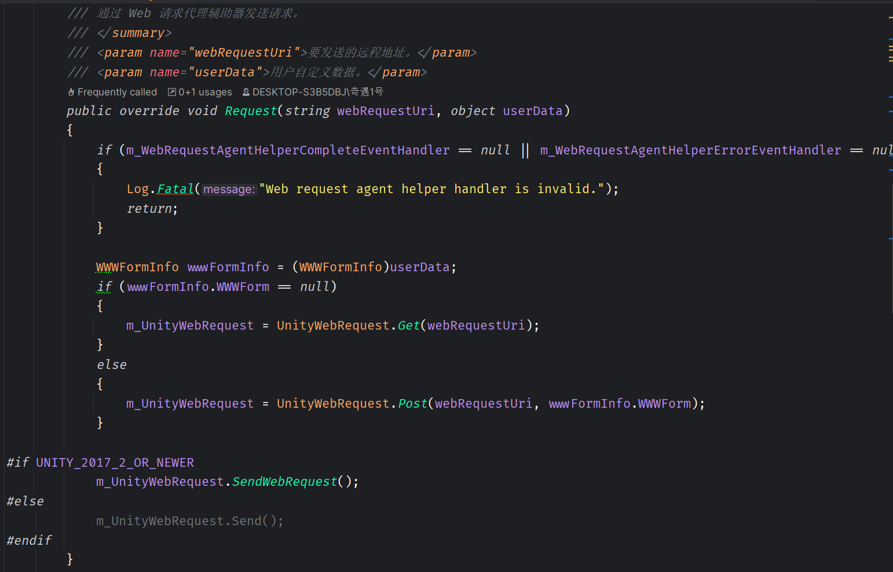


```cs
/// <summary>
/// 增加 Web 请求任务。
/// </summary>
/// <param name="webRequestUri">Web 请求地址。</param>
/// <param name="postData">要发送的数据流。</param>
/// <param name="wwwForm">WWW 表单。</param>
/// <param name="tag">Web 请求任务的标签。</param>
/// <param name="priority">Web 请求任务的优先级。</param>
/// <param name="userData">用户自定义数据。</param>
/// <returns>新增 Web 请求任务的序列编号。</returns>
    private int AddWebRequest(string webRequestUri, byte[] postData, WWWForm wwwForm, string tag, int priority, object userData)
    {
        return m_WebRequestManager.AddWebRequest(webRequestUri, postData, tag, priority, WWWFormInfo.Create(wwwForm, userData));
    }

```


## Procedure

流程不应该划分过多，理想情况应该不是互相依赖的，那样就能像Animator一样任意配置


### 选中Procedure会产生报错

you must initialize procedure

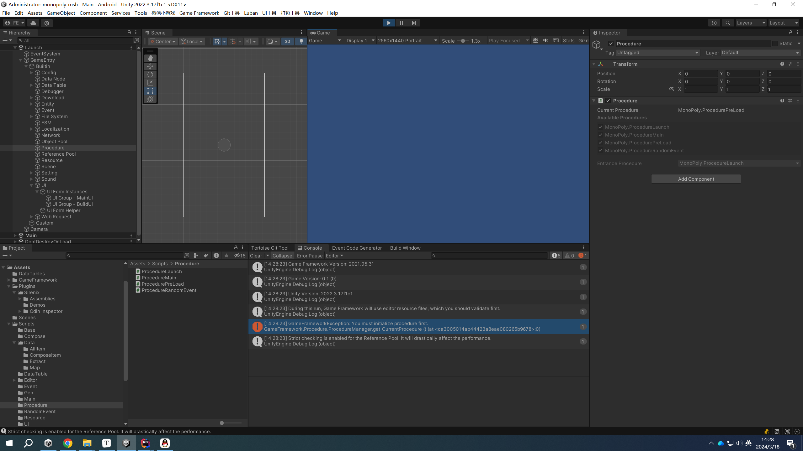

## 实体模块

### 为何要额外添加一个EntityLogic

```
我在这简单说一下我的理解哈，先说Entity这部分，Entity类才是被框架直接管理的类，因为他实现了IEntity接口，这个接口被GF部分管理，而我们业务是继承EnityLogic不直接继承Entity，Entity是个sealed类，最主要的作用是防止业务继承Entity后override了父类方法，改写了原本的逻辑，会破坏了框架的管理逻辑，那怎么办呢，那就是添加一个EnityLogic，业务只能继承EnityLogic，那就不怕Entity的逻辑被覆盖了。至于EnityLogic里持有了Entity，只是比较方便通过EnityLogic获取他对应的Entity而已。
```


## 资源管理

资源

https://www.bilibili.com/video/BV1Kf4y1G7JE/?spm_id_from=333.788.recommend_more_video.1&vd_source=4b8a0e60d0e2277bd2af5ad45b21f4d8

打包

https://www.bilibili.com/video/BV1ch411q7XP/?spm_id_from=333.788.recommend_more_video.4&vd_source=4b8a0e60d0e2277bd2af5ad45b21f4d8


### 根据平台会加载对应AB


### 三种更新模式

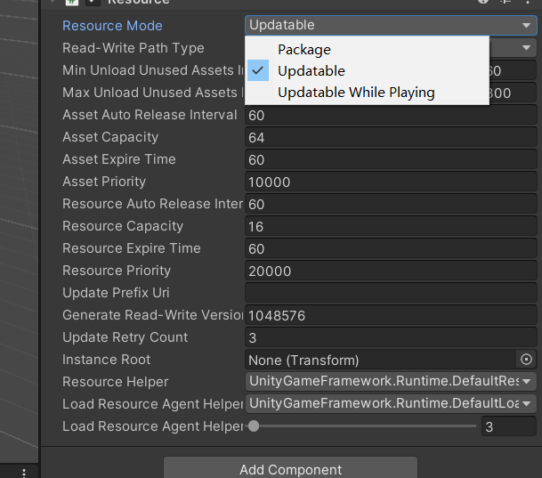


### 打包工具

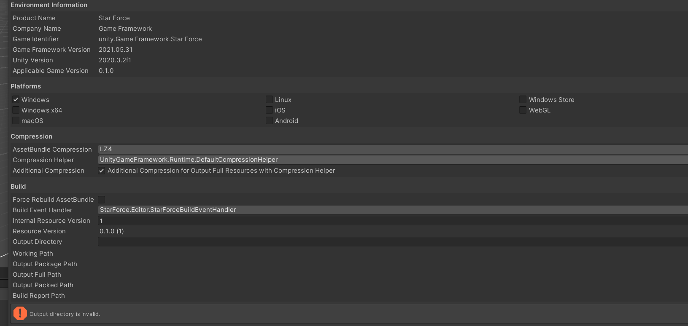


#### ForceBuild

是否强制打包，如果不勾如果已经打包过就不打了


#### ResourceEditorController

默认会从GameFramework/Configs/ResourceEditor.xml里加载配置文件

```css
m_ConfigurationPath = Type.GetConfigurationPath<ResourceEditorConfigPathAttribute>() ?? Utility.Path.GetRegularPath(Path.Combine(Application.dataPath, "GameFramework/Configs/ResourceEditor.xml"));
```

这里也是

```cs
m_ConfigurationPath = Type.GetConfigurationPath<ResourceBuilderConfigPathAttribute>() ?? Utility.Path.GetRegularPath(Path.Combine(Application.dataPath, "GameFramework/Configs/ResourceBuilder.xml"));

```


### 打包出来的文件

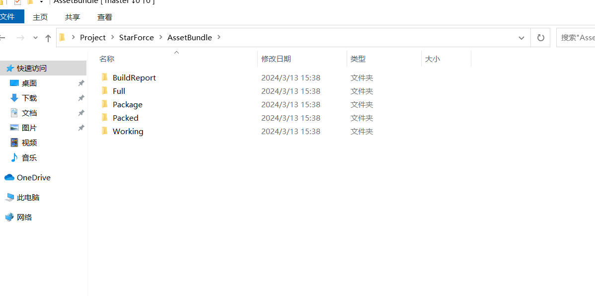

#### BuildReport 报告

#### Full

单独的包

#### Packege

打成一个包


必须要先InitResource

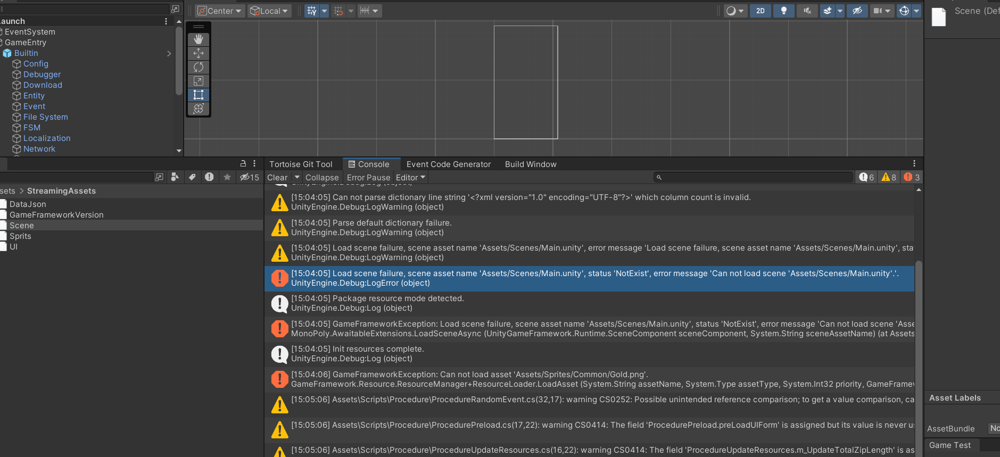

## 热更新流程

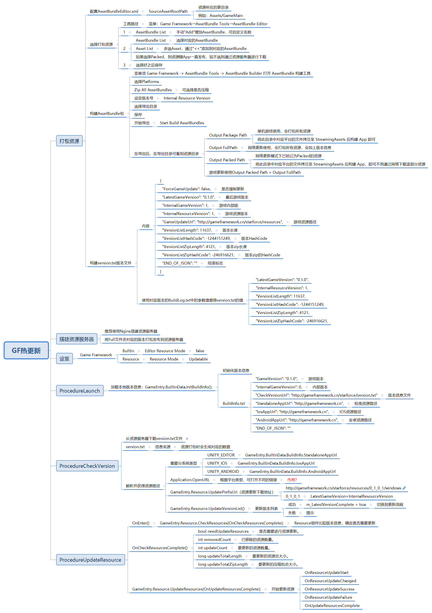

## 引用池

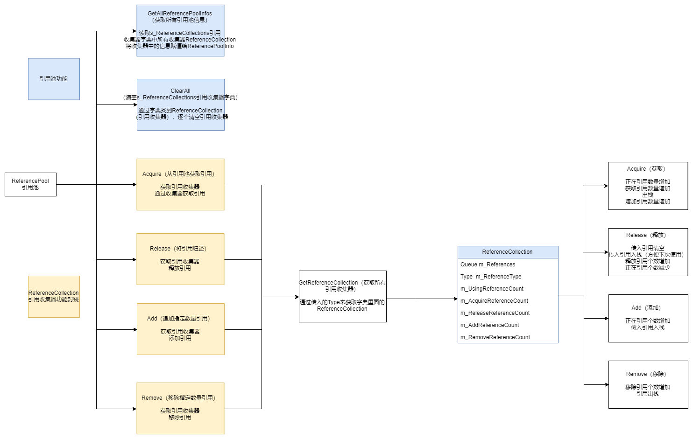


## UI

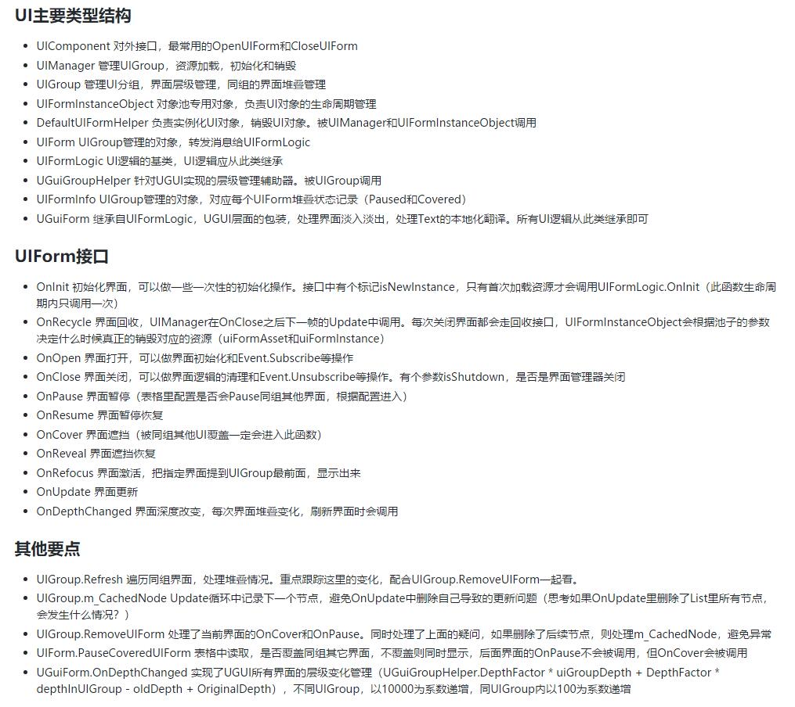

### StartForceUI

从数据表中加载

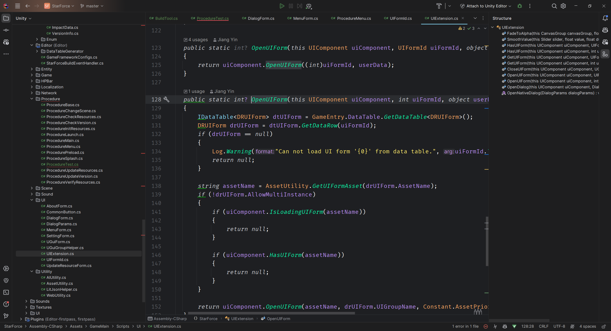

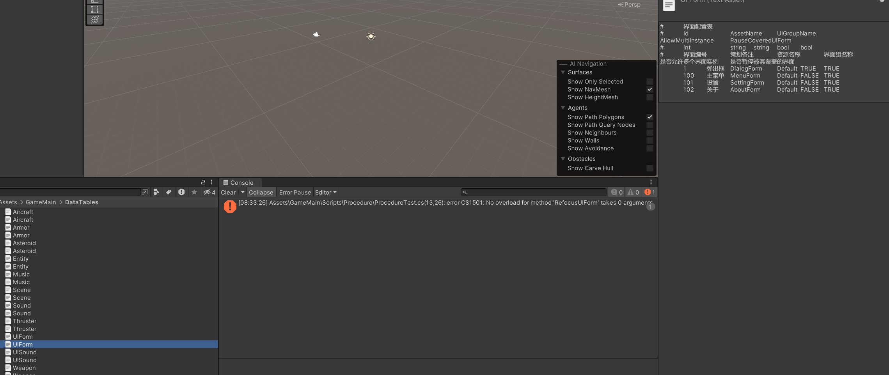


### 打开UI界面

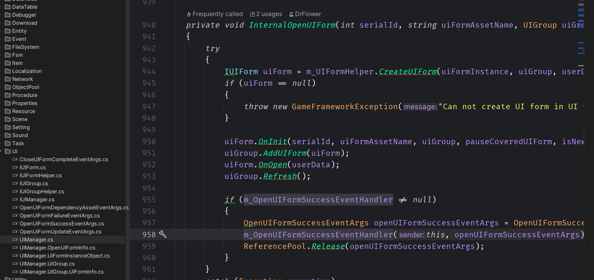

## EventPool

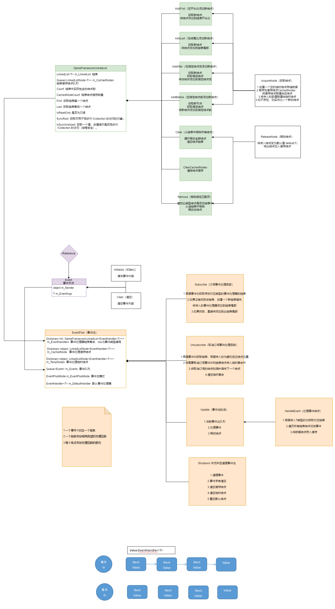

# 安卓打包

https://blog.csdn.net/qq_29848853/article/details/132788896 


## 包体资源优化

https://egostudio.blog.csdn.net/article/details/51459749?spm=1001.2101.3001.6650.1&utm_medium=distribute.pc_relevant.none-task-blog-2%7Edefault%7ECTRLIST%7ERate-1-51459749-blog-106270636.235%5Ev43%5Epc_blog_bottom_relevance_base3&depth_1-utm_source=distribute.pc_relevant.none-task-blog-2%7Edefault%7ECTRLIST%7ERate-1-51459749-blog-106270636.235%5Ev43%5Epc_blog_bottom_relevance_base3&utm_relevant_index=2


https://wanghan.blog.csdn.net/article/details/135987067?spm=1001.2101.3001.6650.2&utm_medium=distribute.pc_relevant.none-task-blog-2%7Edefault%7EYuanLiJiHua%7EPosition-2-135987067-blog-51459749.235%5Ev43%5Epc_blog_bottom_relevance_base3&depth_1-utm_source=distribute.pc_relevant.none-task-blog-2%7Edefault%7EYuanLiJiHua%7EPosition-2-135987067-blog-51459749.235%5Ev43%5Epc_blog_bottom_relevance_base3&utm_relevant_index=5

# 问题

## JsonUtility

这玩意不支持属性

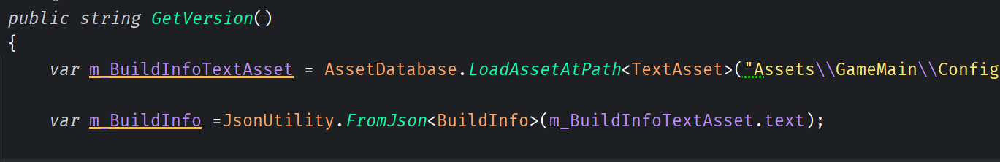

C:\Program Files\Unity\Hub\Editor\2022.3.17f1c1\Editor\Data\PlaybackEngines\AndroidPlayer\SDK\platform-tools

## unity使用adb

https://blog.csdn.net/qq_30144243/article/details/136318038

## 真机调试

https://zhuanlan.zhihu.com/p/616063381

## 分支合并

https://juejin.cn/post/7028965736022278175

合并完删了就好了

工作区 暂存区

## 哪些是必要的Procedure？


## 背包怎么搞？

一个UI下面多个Item怎么搞？

## 重启Game窗口竟然能解决scale变化问题


```cs
    /// <summary>
    /// 更新版本资源列表。
    /// </summary>
    /// <param name="versionListLength">版本资源列表大小。</param>
    /// <param name="versionListHashCode">版本资源列表哈希值。</param>
    /// <param name="versionListZipLength">版本资源列表压缩后大小。</param>
    /// <param name="versionListZipHashCode">版本资源列表压缩后哈希值。</param>
    public void UpdateVersionList(int versionListLength, int versionListHashCode, int versionListZipLength, int versionListZipHashCode)
    {
        if (m_DownloadManager == null)
        {
            throw new GameFrameworkException("You must set download manager first.");
        }

        m_VersionListLength = versionListLength;
        m_VersionListHashCode = versionListHashCode;
        m_VersionListZipLength = versionListZipLength;
        m_VersionListZipHashCode = versionListZipHashCode;
        string localVersionListFilePath = Utility.Path.GetRegularPath(Path.Combine(m_ResourceManager.m_ReadWritePath, RemoteVersionListFileName));
        int dotPosition = RemoteVersionListFileName.LastIndexOf('.');
        string latestVersionListFullNameWithCrc32 = Utility.Text.Format("{0}.{2:x8}.{1}", RemoteVersionListFileName.Substring(0, dotPosition), RemoteVersionListFileName.Substring(dotPosition + 1), m_VersionListHashCode);
        m_DownloadManager.AddDownload(localVersionListFilePath, Utility.Path.GetRemotePath(Path.Combine(m_ResourceManager.m_UpdatePrefixUri, latestVersionListFullNameWithCrc32)), this);
   }
```


```cs
 /// <summary>
        /// 增加下载任务。
        /// </summary>
        /// <param name="downloadPath">下载后存放路径。</param>
        /// <param name="downloadUri">原始下载地址。</param>
        /// <param name="priority">下载任务的优先级。</param>
        /// <param name="userData">用户自定义数据。</param>
        /// <returns>新增下载任务的序列编号。</returns>
        public int AddDownload(string downloadPath, string downloadUri, int priority, object userData)
        {
            if (string.IsNullOrEmpty(downloadPath))
            {
                throw new GameFrameworkException("Download path is invalid.");
            }

            if (string.IsNullOrEmpty(downloadUri))
            {
                throw new GameFrameworkException("Download uri is invalid.");
            }

            if (TotalAgentCount <= 0)
            {
                throw new GameFrameworkException("You must add download agent first.");
            }

            DownloadTask downloadTask = DownloadTask.Create(downloadPath, downloadUri, priority, m_FlushSize, m_Timeout, userData);
            m_TaskPool.AddTask(downloadTask);
            return downloadTask.SerialId;
        }
```

Download failure, download serial id '1', download path 'C:/Users/Administrator/AppData/LocalLow/nightq/MonopolyRush/GameFrameworkVersion.dat', download uri 'http://192.168.0.6:8880/0_0_100_28/Windows/GameFrameworkVersion.2b02a70b.dat', error message 'Timeout'.


## List.Insert 插入的是Index那个位置


