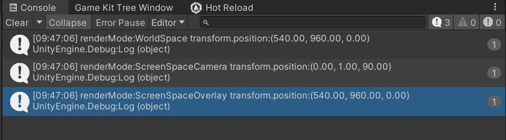
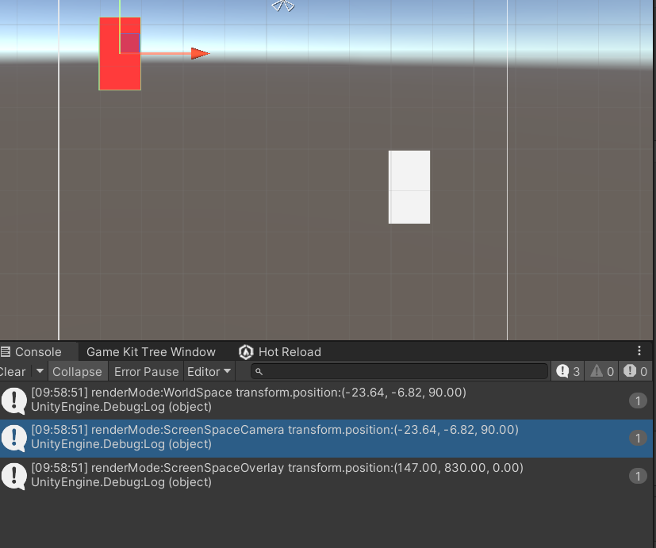
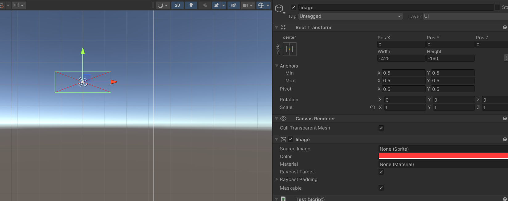
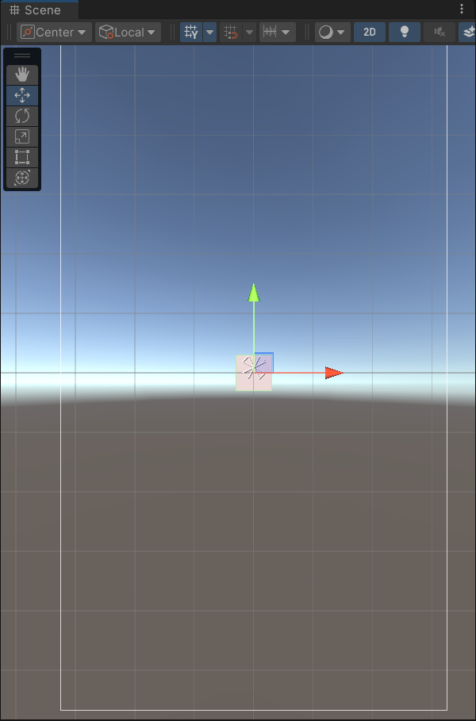
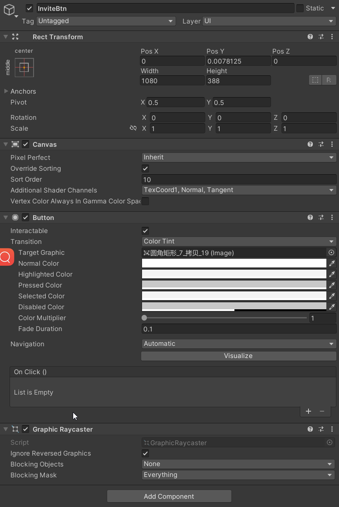
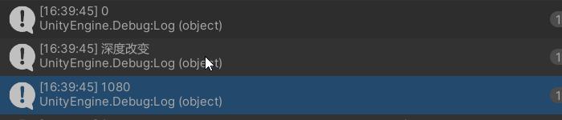

# 设计模式

## MVC

https://blog.csdn.net/qq_46273241/article/details/126805939

https://blog.csdn.net/qq_36709127/article/details/122153113

https://blog.csdn.net/qq_39574690/article/details/80757261

## 关于游戏UI的设计模式

[放牛的星星 ----Unity手游实战：从0开始SLG——UI框架篇（一）各种UI框架模型简介（试读篇）](https://zhuanlan.zhihu.com/p/157273459)


## UI代码开发规范

逻辑以及Log都在Model里面写，UI层只处理自身显示相关的逻辑

## MVVM

在Unity中实现一个简易的MVVM框架，我们需要关注几个关键点：数据绑定（双向和单向）、属性和控件的映射。以下是一个简化的实现方案：


1. 数据绑定基础
   首先，我们需要一个基础的数据绑定类，它能够监听属性的变化并通知视图更新。

```cs
using System;

public class BaseBindableProperty<T>
{
    private T _value;
    public T Value
    {
        get => _value;
        set
        {
            if (!Equals(_value, value))
            {
                _value = value;
                OnValueChanged?.Invoke(_value);
            }
        }
    }

    public event Action<T> OnValueChanged;

    public BaseBindableProperty(T defaultValue = default)
    {
        _value = defaultValue;
    }
}
```

1. 视图模型基类
   接下来，我们需要一个视图模型的基类，它包含了数据绑定属性，并能够通知视图更新。

```cs
public class BaseViewModel
{
    // 在这里定义ViewModel的属性，使用BaseBindableProperty包装
}
```

1. 视图绑定
   视图绑定需要能够将UI控件与ViewModel中的属性绑定起来。这里我们实现一个简单的绑定工具类。

```cs
using UnityEngine;
using UnityEngine.UI;
using System.Reflection;

public static class BindingUtility
{
    public static void BindProperty<T>(BaseBindableProperty<T> property, MonoBehaviour viewComponent, string propertyName)
    {
        property.OnValueChanged += (newValue) =>
        {
            var prop = viewComponent.GetType().GetProperty(propertyName, BindingFlags.Public | BindingFlags.Instance);
            if (prop != null && prop.CanWrite)
            {
                prop.SetValue(viewComponent, newValue, null);
            }
        };
    }

    public static void BindInputField(BaseBindableProperty<string> property, InputField inputField)
    {
        // 单向绑定：ViewModel -> View
        property.OnValueChanged += (newValue) => { inputField.text = newValue; };

        // 双向绑定：View -> ViewModel
        inputField.onValueChanged.AddListener((newValue) => { property.Value = newValue; });
    }
}
```

1. 使用示例
   最后，我们来看一个如何使用这个简易MVVM框架的例子。

```cs
public class ExampleViewModel : BaseViewModel
{
    public BaseBindableProperty<string> ExampleTextProperty = new BaseBindableProperty<string>();
}
```

在Unity的某个UI控制器中绑定ViewModel到视图：


```cs
using UnityEngine;
using UnityEngine.UI;

public class ExampleView : MonoBehaviour
{
    public InputField exampleInputField;
    private ExampleViewModel viewModel = new ExampleViewModel();

    void Start()
    {
        BindingUtility.BindInputField(viewModel.ExampleTextProperty, exampleInputField);
    }
}
```

这个简易的MVVM框架实现了基本的数据绑定功能，包括双向绑定和单向绑定。通过扩展BaseBindableProperty和BindingUtility，可以支持更多类型的数据绑定和控件。这只是一个起点，根据项目的具体需求，这个框架可以进一步扩展和优化。


# 参考文章

https://github.com/vovgou/loxodon-framework/blob/master/README_CN.md

https://github.com/XINCGer/Unity3DTraining/tree/master/UGUITraining 

## 锚点锚框好文

作者：巨龙饿了
链接：https://www.jianshu.com/p/4592bf809c8b
来源：简书
著作权归作者所有。商业转载请联系作者获得授权，非商业转载请注明出处。


[UGUI锚点(Anchors)，轴点(Pivot)及RectTransform组件详解](https://www.jianshu.com/p/5aa5299b491f)

## 官方文档

https://docs.unity3d.com/Packages/com.unity.ugui@1.0/manual/UIAutoLayout.html


# 课程

https://edu.uwa4d.com/course-intro/0/138


## https://github.com/XINCGer/Unity3DTraining/tree/master/UGUITraining

# 原理

## [Event System Manager 事件与触发](https://blog.csdn.net/qq_32821435/article/details/80157388?spm=1001.2014.3001.5502)


## [RectTransform详解](https://www.jianshu.com/p/dbefa746e50d)


## [Unity——RectTransform详解](https://www.jianshu.com/p/4592bf809c8b)


# UGUI原理篇

- [Unity UGUI 原理篇(一)：Canvas 渲染模式](http://arkaistudio.com/blog/190/unity/unity-ugui-原理篇-一：canvas)
- [Unity UGUI 原理篇(二)：Canvas Scaler 缩放核心](http://arkaistudio.com/blog/24/unity/unity-ugui-原理篇二：canvas-scaler-縮放核心)
- [Unity UGUI 原理篇(三)：Rect Transform](http://arkaistudio.com/blog/334/unity/unity-ugui-原理篇三：recttransform)
- [Unity UGUI 原理篇(四)：Event System Manager 事件与触发](http://arkaistudio.com/blog/440/unity/unity-ugui-原理篇四：event-system-manager-事件與觸發)
- [Unity UGUI 原理篇(五)：Auto Layout 自动布局](http://arkaistudio.com/blog/542/unity/unity-ugui-原理篇五：auto-layout-自動佈局)


# 屏幕适配


## 刘海屏

[Unity UI适配总结](https://zhuanlan.zhihu.com/p/482944918)

[【游戏开发进阶】Unity Android刘海屏适配，帮你封装了jar，你不用写java了，直接用c#调用即可_林新发的博客-CSDN博客_unity3d 刘海屏](https://linxinfa.blog.csdn.net/article/details/115346335)

A大的代码。。。

## 相对布局

就是出现锚框的情况

## 绝对布局

瞄框与锚点重合

在`绝对布局`的情况下，`PosX`和`PosY`的值就是Pivot到锚点的值

# UI属性

## sizeDelta


### 瞄点情况

**sizeDelta的值就是OffsetMax-OffsetMin的值**

### 瞄框

在锚框的情况下，offstMax减去Min，得到的将不再是UI元素的大小，而是一个新的奇怪的向量，这个向量代表的物理意义是，**sizeDelta.x值就是锚框的宽度与UI元素的宽度的差值，sizeDelta.y的值就是锚框的的高度与UI元素的高度的差值**

在锚框的情况下，offstMax减去Min，得到的将不再是UI元素的大小，而是一个新的奇怪的向量，这个向量代表的物理意义是，**sizeDelta.x值就是锚框的宽度与UI元素的宽度的差值，sizeDelta.y的值就是锚框的的高度与UI元素的高度的差值**

Pivot中心点，就是该UI元素旋转缩放的中心点，左下角为(0,0)右上角为(1,1)

**这个属性之所以叫做sizeDelta，是因为在锚点情况下其表征的是size（大小），在锚框的情况下其表征的是Delta（差值）**

## Canvas

https://www.arkaistudio.com/blog/2016/03/28/unity-ugui-

原理篇二：canvas-scaler-縮放核心/

Scale Factor直接縮放所有UI元素

### 三种模式下的Canvas坐标

```csharp
[Button]
public void DebugPosition()
{
    GetComponentInParent<Canvas>().renderMode = RenderMode.WorldSpace;
    Debug.Log($"renderMode:{GetComponentInParent<Canvas>().renderMode} transform.position:{transform.position}");
    GetComponentInParent<Canvas>().renderMode = RenderMode.ScreenSpaceCamera;
    GetComponentInParent<Canvas>().worldCamera = Camera.main;
    Debug.Log($"renderMode:{GetComponentInParent<Canvas>().renderMode} transform.position:{transform.position}");
    GetComponentInParent<Canvas>().renderMode = RenderMode.ScreenSpaceOverlay;
    Debug.Log($"renderMode:{GetComponentInParent<Canvas>().renderMode} transform.position:{transform.position}");
}
```

#### 对Canvas执行




在Unity中，当Canvas的渲染模式为Screen Space - Camera时，Canvas的位置是相对于相机的。如果你的Canvas的位置是(0, 1, 90)，那么这个位置是相对于相机的。

这个位置的含义是：

x = 0：Canvas的中心点在相机的x轴上。

y = 1：Canvas的中心点在相机的y轴上，且在相机的上方1个单位。

z = 90：Canvas的中心点在相机的z轴上，且在相机的前方90个单位。

所以，Canvas的中心点实际上是在相机的前方90个单位，且在相机的上方1个单位。这就是为什么你看到的x坐标是0的原因。


#### 对UI执行




## anchoredPosition


通过直接设置anchoredPosition的值可以改变UI元素的位置，但也是要分`锚点`和`锚框`的情况


在使用`锚点`的情况下，anchoredPosition表征的是元素Pivot到Anchor的距离


## ScreenPointToLocalPointInRectangle


public static bool ScreenPointToLocalPointInRectangle(RectTransform rect, Vector2 screenPoint, Camera cam, out Vector2 localPoint)
将一个屏幕坐标转换为给定矩形里的坐标
需要注意的是，屏幕坐标是以像素为单位，左下角为(0,0),而返回的坐标是相对于给定矩形的pivot的坐标。
即使点在给定矩形外，依然返回true？此处待研究 .


作者：迷途小路
链接：https://www.jianshu.com/p/185cbe4ee981


# 移动UI


## transform.position


transform.position对应UI锚点的位置,锚点决定了UI坐标轴的圆点

1920*1080屏幕,左下角都是(0,0)右上角(1920,1080)

屏幕左下角为（0,0）点【原点】，右上角为（Screen.宽度，Screen高度）

UI坐标的起点位置是屏幕中心点，如果想实现一个鼠标点击到哪，图片就出现在哪，需要将屏幕坐标`Input.mousePosition`转化为UI坐标。比如屏幕坐标值是（Screen.width/2，Screen.height/2），在UI坐标里正好是0

Canvas以原点中心


# Scroll View

Content与Viewport大小一致，就无法移动，大于Viewport才可以移动。


# 坑

[Unity 3D之UI设置父子关系setParent坑 - CodeAntenna](https://codeantenna.com/a/ql6KctqvMy)


DoTween GetComponent<RectTransform>().DOMoveY()

与transform.DOMoveY不太一样，

如何写个通用的移到UI边缘的方法？


```csharp
var pos = RedBtn.transform.localPosition;
RedBtn.transform.DOMoveY(BottomDisc.transform.position.y+0.4f,0.5f);
CloseActions.Add(() =>
{
    RedBtn.transform.localPosition = pos;
});
```


# verticalNormalizedPosition 有误差！

# UGUI源码

[UGUI源码分析](https://blog.csdn.net/qq_28820675/category_9923575.html)

[UGUI源码解读、性能优化、图文混排等](https://www.zhihu.com/column/c_1440746540318650368)


```csharp
TweenerCore<Vector2, Vector2, VectorOptions> AnimMoveOutImp(RectTransform rectTransform,float duration = 0.5f)
        {
            var anchoredPosition = rectTransform.anchoredPosition;
            var bottomDistance = anchoredPosition.y -= GetBottomDistance(rectTransform);
            return rectTransform.DOAnchorPosY(bottomDistance, duration);
        }
   
       

        /// <summary>
        /// 获取UI上边缘左上角顶部到屏幕底部的距离
        /// </summary>
        /// <returns></returns>
        public float GetBottomDistance(RectTransform rectTransform)
        {
            // 获取UI元素在屏幕上的边界
            Vector3[] corners = new Vector3[4];
            rectTransform.GetWorldCorners(corners);

            // 计算UI元素上面的Y坐标
            float bottomY = corners[1].y;

            // 计算屏幕底部的Y坐标
            float screenHeight = Screen.height;
            float screenBottomY = 0; // 屏幕底部Y坐标

            // 计算UI到屏幕底部的距离
            float distanceToBottom = bottomY - screenBottomY;
            
            return distanceToBottom;
        }
```


# UI位置

## 移动到屏幕中央


```csharp
var uiElement = GetComponent<RectTransform>();
Vector2 center = new Vector2(0.5f, 0.5f); // 屏幕中央的锚点位置
uiElement.pivot = center;
uiElement.anchorMin = center;
uiElement.anchorMax = center;
uiElement.anchoredPosition = Vector2.zero;
//这样UI会造成形变挤压显示不出来
```




Canvas随屏幕缩放时，到GetWordCorner是到Canvas底部的距离吧，<font color=red>X</font>

应该是到屏幕底部（也就是分辨率）的距离


## 世界坐标到ugui屏幕坐标

[Unity ugui屏幕适配与世界坐标到ugui屏幕坐标的转换](https://cloud.tencent.com/developer/article/1601274)

[Unity 极简UI框架](https://cloud.tencent.com/developer/article/1624926)

[Unity UGUI 原理篇(二)：Canvas Scaler 縮放核心](https://www.arkaistudio.com/blog/2016/03/28/unity-ugui-%e5%8e%9f%e7%90%86%e7%af%87%e4%ba%8c%ef%bc%9acanvas-scaler-%e7%b8%ae%e6%94%be%e6%a0%b8%e5%bf%83/)


[Unity 世界坐标、屏幕坐标、UGUI 坐标 相互转换](https://blog.csdn.net/LIQIANGEASTSUN/article/details/124413387)

[Unity 中 Screen坐标 转 Canvas坐标](https://blog.csdn.net/NRatel/article/details/101056517)  [大佬的文章包含ListView GridView](https://blog.csdn.net/nratel/category_8301031.html)


[Canvas](https://so.csdn.net/so/search?q=Canvas&spm=1001.2101.3001.7020)坐标系，以屏幕中心为原点，向右为X轴正方向，向上为Y轴正方向。

设置transform.position = new Vector3(0, 0, 0);会出现在屏幕中央



## GetWorldCorners

使用这个方法，可以取得UI元素四个角的世界坐标，具体使用方法，先建立一个长度为4的vector3数组，然后传进这个方法，调用一次后，数组被赋值，里面的四个元素分别是UI的`左下角` ，`左上角`，`右上角`，`右下角`。


```csharp

```


# 红点系统

[Unity手游实战：从0开始SLG——独立功能扩展（三）用树实现客户端红点系统](https://zhuanlan.zhihu.com/p/85978429)


# 拼UI工具


[【Unity编辑器扩展】(三)PSD转UGUI Prefab, 一键拼UI解放美术/程序(完结)](【Unity编辑器扩展】(三)PSD转UGUI Prefab, 一键拼UI解放美术/程序(完结))


## 下载PSD解析库

https://releases.aspose.com/psd/net/


# 自定义渲染顺序

不太推荐用不好使，如果在单独一个界面还好，新打开页面覆盖的话，又要处理层级问题




# 面试


[Unity游戏开发面试题目总结](https://juejin.cn/post/7080066817414135815?from=search-suggest)

```csharp
1.不能从上往下滚
2.刷新问题，用代码滚不能刷新
```


78原来的

63整理后

图层_4_1


```csharp
private static void Find()
{
    if (fileContents==null||fileContents.Count==0)
    {
        ReadFileContents();
    }
    Parallel.ForEach(fileContents, kvp =>
    {
        if (Regex.IsMatch(kvp.Value, _oldGuid))
        {
            Debug.Log("替换了资源的路径：" + kvp.Key+GetRelativeAssetsPath(kvp.Key));

            var newContent = kvp.Value.Replace(_oldGuid, _newGuid);
            File.WriteAllText(kvp.Key, newContent);
        }
        else
        {
            Debug.Log("查看了的路径：" + kvp.Key);
        }
    });

    AssetDatabase.Refresh();
    Debug.Log("替换结束");
}

 for (int i = 0; i < 10; i++)
            {
     old = 数据【i】, newObj=数据【i】
              _oldGuid = AssetDatabase.AssetPathToGUID(AssetDatabase.GetAssetPath(old));
            _newGuid = AssetDatabase.AssetPathToGUID(AssetDatabase.GetAssetPath(newObj));
     Find();
            }这里_oldGuid与_newGuid是静态变量，Find方法会出现问题吗，有没有可能 Parallel.ForEach还没执行完，_oldGuid与_newGuid就被重新赋值了

```


```csharp
    public override void OnPreviewGUI(Rect r, GUIStyle background)
    {
        base.OnPreviewGUI(r, background);
        if (target == null)
            return;
    
        var targetGameObject = target as GameObject;
    
        if (targetGameObject == null)
            return;
    
        // 判断是否在指定文件夹下
        string assetPath = AssetDatabase.GetAssetPath(targetGameObject);
    
    
        GUI.Label(r, target.name + " is being previewed");
        preview = AssetPreview.GetAssetPreview(target);
    
    
        if (preview == null)
        {
            string guid = AssetDatabase.AssetPathToGUID(assetPath);
    
            string pathname = Path.Combine(cachePreviewPath, guid + ".png");
            if (!Directory.Exists(cachePreviewPath))
            {
                Directory.CreateDirectory(pathname);
            }
    
            preview = AssetDatabase.LoadAssetAtPath<Texture2D>(pathname);
            // if (preview == null)
            // {
            //     preview = PrefabPreview.GetAssetPreview(targetGameObject);
            //
            //     if (PrefabPreview.SaveTextureToPNG(preview as Texture2D, pathname))
            //     {
            //         AssetDatabase.ImportAsset(pathname);
            //         AssetDatabase.Refresh();
            //         Debug.Log("SaveTextureToPNG " + pathname);
            //     }
            // }
        }
    
        if (preview != null)
        {
            GUI.DrawTexture(r, preview);
        }
    }
```

# UI预制体缩略图

[Unity Prefab 缩略图全黑无法预览](https://www.jianshu.com/p/e8d54facf4af)


# TextMesh

## 富文本

[Unity TextMeshPro 支持的富文本标签及详解](https://zhuanlan.zhihu.com/p/458678835)


锚点是四个角在一起，锚框是显示在四个角，不在一起，与之相关的属性为Anchor

pivot是用来控制旋转移动的


自适应的物体加载出来，加载的那一帧是不会自适应的，尺寸是（0，0）所以需要等下一帧

```cs
var rect = _scroll.viewport.rect;
Debug.Log(_scroll.viewport.rect.width);
await UniTask.NextFrame();
Debug.Log(_scroll.viewport.rect.width);
```




```csharp
        /// <summary>
        /// 获取倍率
        /// </summary>
        public uint GetRadio()
        {

            var weightArray = GameEntry.Data.dataStealHome.GetGoldRewardList(ExtractMultiple); 
            int weight = Random.Range(0, 100);
            //根据weightArray每个值所占权重获取对应索引
            int currentWeight = 0;
            for (int i = 0; i < weightArray.MultipleChance.Count; i++)
            {
                currentWeight += weightArray.MultipleChance[i];
            
                if (weight < currentWeight)
                {
                    return (uint)weightArray.Multiple[i];
                }
            }
            
            Log.Error("没有找到对应的倍率");
            
            return 0;
        }
```

