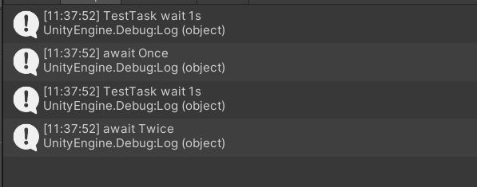
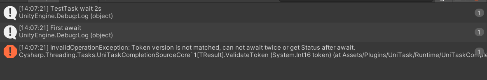

# 使用指南

[UniTask中文使用指南(一)](https://zhuanlan.zhihu.com/p/572670728)


[Unity中有什么情况下是需要用UniTask替代其他异步方式的吗? - 南风咖啡达也酱的回答 - 知乎](https://www.zhihu.com/question/639476510/answer/3361756013)

UniTask优势：

1. 异常处理，层层向上抛出错误
2. 不需要像携程一样用Mono对象触发
3. 0GC


# 源码刨析

[Unity异步扩展实践（一）——以UniTask库为参考](https://summid.icu/index.php/2023/10/01/stasktutorials1/)


直接同时执行完了，没有等待

```csharp
    [Button("测试连接")]
    public  async void UIDisplay()
    {

        var a = TestTask();
        var b = TestTask();
        await a;
        Debug.Log("await Once");

        await b;

        Debug.Log("await Twice");
    }

    public async UniTask TestTask()
    {

        await UniTask.Delay(1000);
        Debug.Log("TestTask wait 1s");
    }
```




```csharp
public  async void UIDisplay()
    {

        var task = TestTask();
        await task;
        Debug.Log("First await");

        var task2 = TestTask();
        await task2;
        Debug.Log("Second await");
    }
        
```


## UniTask不能Await两次的，但原生的可以

### 原生


### UniTask



```csharp
[Button("测试RawTask")]
public  async void RawTaskTest()
{

    var task = TestTask();
    await task;
    Debug.Log("First await");

    await task;
    Debug.Log("Second await");
}
[Button("测试UniTask")]
public  async void UniTaskTest()
{

    var task = TestUniTask();
    await task;
    Debug.Log("First await");

    await task;
    Debug.Log("Second await");
}
public async Task TestTask()
{

    await Task.Delay(2000);
    Debug.Log("TestTask wait 2s");
}       
public async UniTask TestUniTask()
{

    await UniTask.Delay(2000);
    Debug.Log("TestTask wait 2s");
}

```

