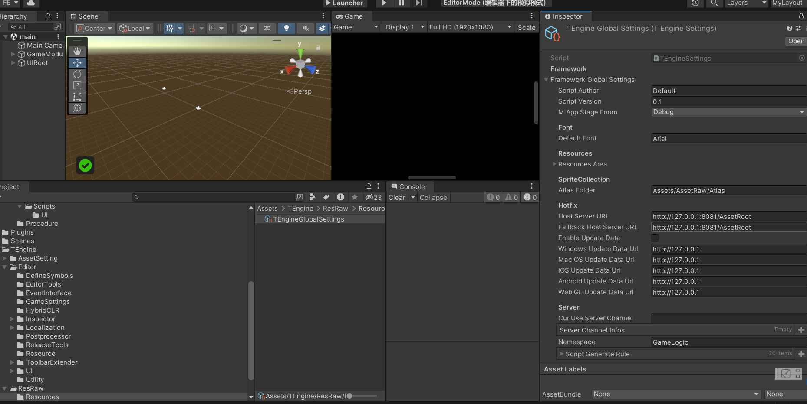

感觉事件主要是跟UI进行联动的，视图与逻辑分离

### ui中可以使用System中的方法，反过来通过事件分发，这样的好处是？


### Player类里玩家活动通过事件派发给其他，这样的好处？

System跟UI都能接受到？


Player类

玩家的攻击死亡都是通过事件派发，自己只作为一个事件触发器

```cs
	void OnTriggerEnter(Collider other)
	{
		var name = other.gameObject.name;
		if (name.StartsWith("enemy") || name.StartsWith("asteroid"))
		{
            //这里还是通过事件派发
			GameEvent.Send(ActorEventDefine.PlayerDead,transform.position, transform.rotation);
			PoolManager.Instance.PushGameObject(this.gameObject);
		}
	}
```

其他感觉没啥说的了，UI有个AddUIEvent看着还挺方便的

花桑塔防有类似实现

# TEngine


## 事件模块

 MVE


### EventInterface

升级拓展GameEvent,支持基于Interface的方法调用抛出事件，以及自动化根据声明的Interface来生成实现代码。

```csharp
/************************************************************************************************************
Class Name:     EventInterfaceGenerate.cs
Type:           Editor, Generator, Util, Static
Definition:
用法，在目录"Assets/GameScripts/HotFix/GameLogic/Event/Interface/"下分组照示例声明Interface 模块待抛出事件的接口。编译后自动生成接口实现抛出的脚本。
Example:
                
旧版抛出事件方式：  GameEvent.Send(RuntimeId.ToRuntimeId("OnMainPlayerCurrencyChange"),CurrencyType.Gold,oldVal,newVal);
新版抛出事件方式 ：
GameEvent.Get<IActorLogicEvent>().OnMainPlayerCurrencyChange(CurrencyType.Gold,oldVal,newVal); 
                
************************************************************************************************************/
```

 优化抛出事件，通过接口约束事件参数

### 与GF区别

GF是直接把obj转Event_Arg类的


### 生成代码逻辑

​    [EventInterface(EEventGroup.GroupBattle)]需要写明特性，会自动扫描到接口，生成实现类

```c#
using TEngine;

namespace GameLogic
{
    [EventInterface(EEventGroup.GroupBattle)]
    public interface IBattleEvent
    {
         void AttackPlayer();
         void AttackEnemy();
         
         void GameOver(int time,int score);
    }
}
```


### 问题

#### 为什么UI要分组呢？


对于事件的发起者，如何处理呢，我之前是用的ID，有更好的方法吗

TEngine的ActorEvent？


事件监听参数确定了

```c#
/// <summary>
/// 增加事件监听。
/// </summary>
/// <param name="eventType">事件类型。</param>
/// <param name="handler">事件处理回调。</param>
/// <typeparam name="TArg1">事件参数1类型。</typeparam>
/// <typeparam name="TArg2">事件参数2类型。</typeparam>
/// <returns></returns>
public static bool AddEventListener<TArg1, TArg2>(int eventType, Action<TArg1, TArg2> handler)
{
    return _eventMgr.Dispatcher.AddEventListener(eventType, handler);
}

```


#### 高效且无GC？为何事件也会有GC嘛？


## 设置模块

### SettingUtil

包含不同模块的设置

我一直也想实现一个全局配置文件来的，这个可以参考下



## 

## UI模块


