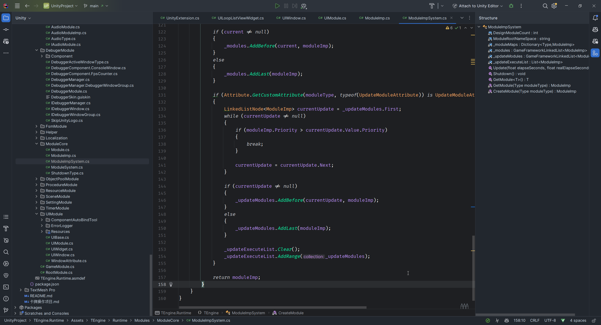

# A大语录


这个得看看dotween的编辑器代码了，估计是默认判断这个目录是否存在 不存在的话就创建这个

实测不行，dotween写的比较蠢不支持自定义目录 只认根目录的Resources文件夹


## UI配置问题

今天突发奇想要是有个工具，把切换页面跳的都可以配置，与游戏代码完全隔离开，用GrapView


```csharp
最好的方式 再加一份声音配置表。通过声音 id 走拓展方法播放。
其实包括 UI 最好都加一份 ui 配置表
```


## 分渠道打包问题

细节我记不太清了 我记得直接在 unityplayactivity 调用调用层的java 类。还封装了一个 sdk 的调用层的 java 类，对应的包在这个调用层引用

按照渠道分文件夹，放里面啊 里面还有 AndroidMainfest 的配置呢

一个渠道一个调用类啊...不理解为啥会有你提出的问题

打包的母工程没有任何渠道的，后处理的时候根据渠道的 java 文件和 sdk 组装成新的

都说了，没有那么复杂。组合之前母工层是没有调用任何渠道的SDK跟引用包的，包括也没有SDK的文件。你组合之后只是把。你最简单的方法就一个渠道一个 MainActivity。拷贝过去就行了.


## Window与Panel的区分

我今天在搞UI这块 哪些部分用来分window还有点懵 上家刚开始写的时候还是单独分了全屏的panel和popupwindow这样


## 界面子UI问题

UI配置


## 思考

感觉事件主要是跟UI进行联动的，视图与逻辑分离

```csharp
确实如此 
```


### ui中可以使用System中的方法，反过来通过事件分发，这样的好处是？


### Player类里玩家活动通过事件派发给其他，这样的好处？

System跟UI都能接受到？


Player类

玩家的攻击死亡都是通过事件派发，自己只作为一个事件触发器

```cs
	void OnTriggerEnter(Collider other)
	{
		var name = other.gameObject.name;
		if (name.StartsWith("enemy") || name.StartsWith("asteroid"))
		{
            //这里还是通过事件派发
			GameEvent.Send(ActorEventDefine.PlayerDead,transform.position, transform.rotation);
			PoolManager.Instance.PushGameObject(this.gameObject);
		}
	}
```

其他感觉没啥说的了，UI有个AddUIEvent看着还挺方便的

花桑塔防有类似实现

# TEngine

## Module模块

UpdateModuleAttribute，注入此属性标识模块需要轮询

如何把Module与ModuleImp关联起来

很简单

```csharp
声明接口 IProcedureManager
ProcedureManager 继承 IProcedureManager
如下，实现了依赖注入    
public sealed class ProcedureModule : Module
{
    private IProcedureManager _procedureManager = null;
	protected override void Awake()
        {
            base.Awake();
            _procedureManager = ModuleImpSystem.GetModule<IProcedureManager>();
            if (_procedureManager == null)
            {
                Log.Fatal("Procedure manager is invalid.");
            }
        }
}
```

### 如何通过接口找到对应Imp模块的

```csharp
module.Name.Substring(1) 把I去掉就可以了
```




## 事件模块

 MVE


### EventInterface

升级拓展GameEvent,支持基于Interface的方法调用抛出事件，以及自动化根据声明的Interface来生成实现代码。

```csharp
/************************************************************************************************************
Class Name:     EventInterfaceGenerate.cs
Type:           Editor, Generator, Util, Static
Definition:
用法，在目录"Assets/GameScripts/HotFix/GameLogic/Event/Interface/"下分组照示例声明Interface 模块待抛出事件的接口。编译后自动生成接口实现抛出的脚本。
Example:
                
旧版抛出事件方式：  GameEvent.Send(RuntimeId.ToRuntimeId("OnMainPlayerCurrencyChange"),CurrencyType.Gold,oldVal,newVal);
新版抛出事件方式 ：
GameEvent.Get<IActorLogicEvent>().OnMainPlayerCurrencyChange(CurrencyType.Gold,oldVal,newVal); 
                
************************************************************************************************************/
```

 优化抛出事件，通过接口约束事件参数

### 与GF区别

GF是直接把obj转Event_Arg类的


### 生成代码逻辑

​    [EventInterface(EEventGroup.GroupBattle)]需要写明特性，会自动扫描到接口，生成实现类

```c#
using TEngine;

namespace GameLogic
{
    [EventInterface(EEventGroup.GroupBattle)]
    public interface IBattleEvent
    {
         void AttackPlayer();
         void AttackEnemy();
         
         void GameOver(int time,int score);
    }
}
```


### 问题

#### 为什么UI要分组呢？


对于事件的发起者，如何处理呢，我之前是用的ID，有更好的方法吗

TEngine的ActorEvent？


事件监听参数确定了

```c#
/// <summary>
/// 增加事件监听。
/// </summary>
/// <param name="eventType">事件类型。</param>
/// <param name="handler">事件处理回调。</param>
/// <typeparam name="TArg1">事件参数1类型。</typeparam>
/// <typeparam name="TArg2">事件参数2类型。</typeparam>
/// <returns></returns>
public static bool AddEventListener<TArg1, TArg2>(int eventType, Action<TArg1, TArg2> handler)
{
    return _eventMgr.Dispatcher.AddEventListener(eventType, handler);
}

```


#### 高效且无GC？为何事件也会有GC嘛？


## 设置模块

### SettingUtil

包含不同模块的设置

我一直也想实现一个全局配置文件来的，这个可以参考下


## 

## UI模块

### 自动绑定工具


### 异性屏支持


### UIWidget

UI组件类，用于红点，按钮等一些通用模块

### UIWindow

窗口类

并没有继承Monobehavior而是选择在类中持有对象

每个UI都有Window特性，用于选择层级，分组，资源路径等

### 创建UI的关键代码


之前使用的Tab模块好用吗？虽然减少了代码量，减少了页面的组件数量

但做公益那部分时不可避免的出来许多问题，维护这种关系，而且有可能两个界面都有这个组件但位置以及其它一些属性不一样

两个解决方案吧，又想了一个

1. 挂载到Unity上，实现一个切换Tab预览的功能，不要在代码里面添加了
2. 每个界面依然各自摆放组件，但运行时动态去重，那些相同的预制体收集到一起，大概率功能都是相同的
3. 目前这种把一堆页面摆放在一起的这种方式不太合理，应该用UIWidget加动态选择资源来处理，但这样可能也麻烦，而且预览起来不方便


# YIUI

一对多绑定
