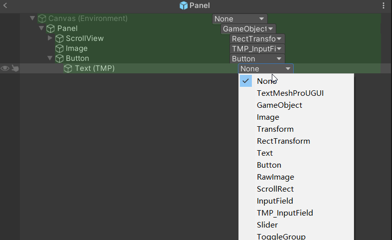
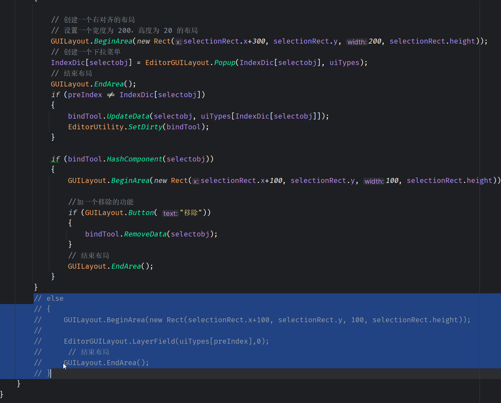

[烟雨](https://zhuanlan.zhihu.com/p/259283786)

InstanceID每次进预制体都不一样。。。

[GUI使用](https://zhuanlan.zhihu.com/p/37710715)


[Unity3d Editor 编辑器扩展功能详解  这个很全 ](https://zhuanlan.zhihu.com/p/503154643)


```csharp
ShopItem.TopNewBuyTipTxt	首充+{0}
ShopItem.ExtraTxt	額外增加{0}%

```

[Unity编辑器拓展 晓寒](https://blog.csdn.net/m0_46712616/category_11460925.html)


这里倒是没啥问题,

```csharp
 private static Dictionary<string, bool> boolDic = new Dictionary<string, bool>();
        bool isToggle=false;

            if (!boolDic.ContainsKey(selectobj.name))
        {
            boolDic.Add(selectobj.name, false);
        }
        boolDic[selectobj.name]=EditorGUI.Toggle(selectionRect, boolDic[selectobj.name]);
```

即便用本地字典也还是会检测不到



这段代码去掉一点问题都没有了,应该是点击的同时点到其他位置了,换成GUI.Box一点问题也没了





```csharp
 if (!IndexDic.ContainsKey(selectobj))
                {
                    IndexDic.Add(selectobj, preIndex);
                }
                if (Selection.instanceIDs.Contains(instanceID))
                {
                  
                    // 创建一个右对齐的布局
                    // 设置一个宽度为 200，高度为 20 的布局
                    GUILayout.BeginArea(new Rect(selectionRect.x+300, selectionRect.y, 200, selectionRect.height));
                    // 创建一个下拉菜单
                    IndexDic[selectobj] = EditorGUILayout.Popup(IndexDic[selectobj], uiTypes);
                    // 结束布局
                    GUILayout.EndArea();
                    if (preIndex != IndexDic[selectobj])
                    {
                        bindTool.UpdateData(selectobj, uiTypes[IndexDic[selectobj]]);
                        EditorUtility.SetDirty(bindTool);
                    }

                    if (bindTool.HashComponent(selectobj))
                    {
                        GUILayout.BeginArea(new Rect(selectionRect.x+100, selectionRect.y, 100, selectionRect.height));

                        //加一个移除的功能
                        if (GUILayout.Button( "移除"))
                        {
                            bindTool.RemoveData(selectobj);
                        }
                        // 结束布局
                        GUILayout.EndArea();
                    }
```

