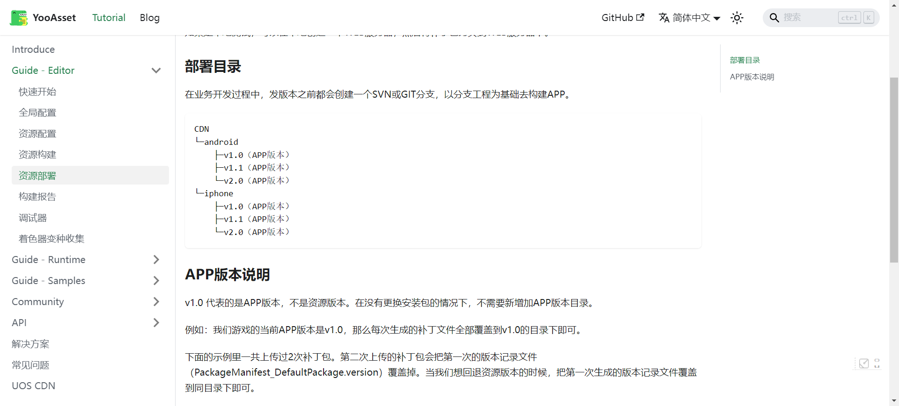
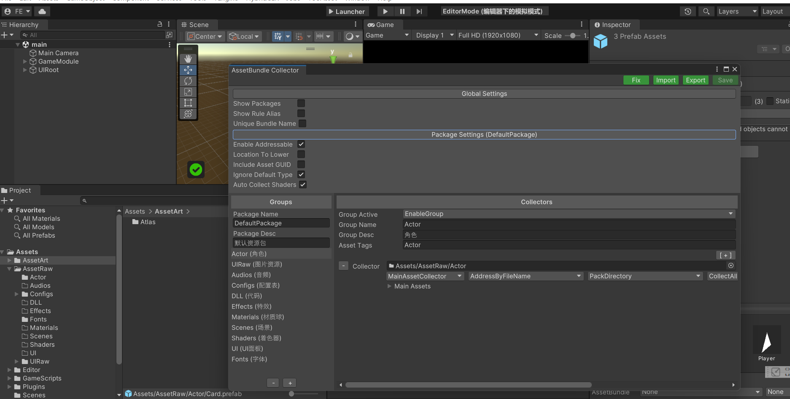

# YooAsset

打包流程大致跟GF类似


回退资源会进行版本覆盖，这样就没我那样实现这么乱了



## 可寻址模式



开启后直接不用加扩展名和路径就可以访问到了

```cs
var assetAsync = await GameModule.Resource.LoadAssetAsync<GameObject>("Card",CancellationToken.None);
```


# 导入资源

## [Unity导入图片尺寸大小和压缩格式的问题](https://blog.csdn.net/linxinfa/article/details/108827197)


[Unity做导入资源的统一处理](https://zhuanlan.zhihu.com/p/88568714)


[Unity插件——Odin使用心得(一)「建议收藏」](https://cloud.tencent.com/developer/article/2104696)


# 去除冗余资源


# 构建加速

[Unity构建版本速度优化-软件篇](https://zhuanlan.zhihu.com/p/348367281)


# 版本控制


[Unity ScriptableObject 实例不随资源文件更新的解决方案](https://blog.csdn.net/iFasWind/article/details/127747082)

