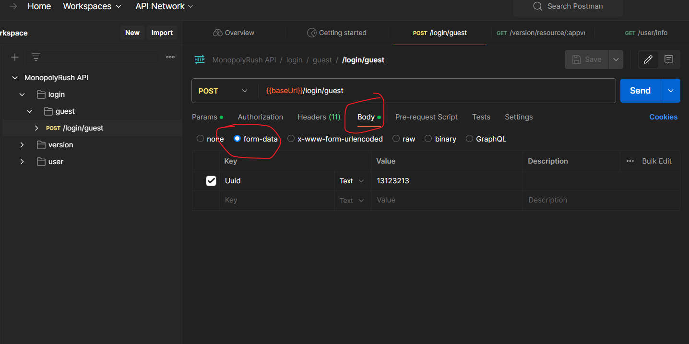
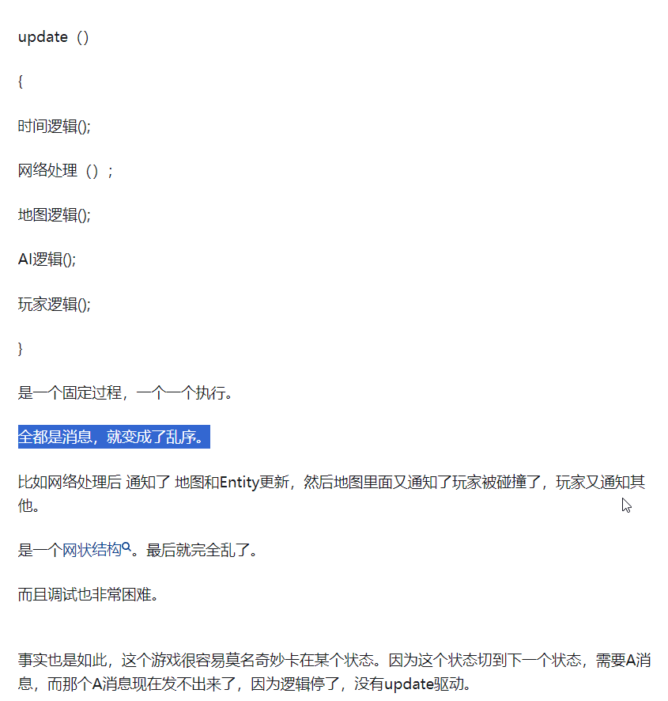

## ProcessStart执行的命令配置环境变量后要重启下电脑


## 请求的网站千万不能包含双斜杠//


## Post

Post好像不能明文传输

Post请求表单在Body里

```
unityWebRequst设置的 Content-Type 默认是 application/x-www-form-urlencoded
```



## 移动平台路径

https://blog.csdn.net/yhy2218/article/details/50789711


## RSA

https://zh.wikipedia.org/wiki/RSA%E5%8A%A0%E5%AF%86%E6%BC%94%E7%AE%97%E6%B3%95
RSA（Rivest-Shamir-Adleman）算法是一种非对称加密算法，用于加密和解密数据以及数字签名。它是一种基于数学原理的加密算法，由Ron Rivest、Adi Shamir和Leonard Adleman于1977年共同提出。

RSA算法基于两个关键的数学问题：大整数分解问题和模幂运算问题。其安全性基于大整数分解的难度，即在较短的时间内，从一个非常大的数中找到它的质因数。目前尚未找到有效的算法能够在多项式时间内解决大整数分解问题，因此RSA算法被广泛认为是一种安全可靠的加密算法。

RSA算法的基本原理包括以下几个步骤：

1. **密钥生成：** 首先生成一对公钥和私钥。公钥用于加密数据，私钥用于解密数据或生成数字签名。
2. **加密：** 使用公钥对要发送的数据进行加密。加密过程中，原始数据会被转换成大整数，并通过模幂运算得到密文。
3. **解密：** 接收方使用私钥对收到的密文进行解密，还原成原始数据。
4. **数字签名：** 使用私钥对数据进行签名，用于验证数据的完整性和真实性。接收方可以使用对应的公钥验证数字签名。

RSA算法在信息安全领域中得到广泛应用，包括加密通信、数字签名、身份认证等方面。然而，需要注意的是，RSA算法的加解密速度相对较慢，对于大量数据的加密处理可能会影响性能，因此在实际应用中可能会结合其他加密算法来提高效率和安全性。


## 代码格式化工具

## 代码模板工具

### Luban使用的

Scriban是一个.NET标准的模板引擎，用于生成文本输出，例如生成代码文件、配置文件、HTML等。它具有简洁的语法和强大的功能，适用于各种场景，包括代码生成、静态网站生成、电子邮件模板等。

以下是Scriban的一些主要特点和用途：

1. **语法简洁明了：** Scriban采用类似于Liquid模板引擎的语法，易于学习和使用。
2. **强大的表达式和控制流：** Scriban支持丰富的表达式和控制流，包括条件判断、循环、过滤器等，使模板编写更加灵活和强大。
3. **模板继承和包含：** Scriban支持模板继承和包含，可以在模板中引用其他模板，实现模块化和复用。
4. **自定义函数和过滤器：** 可以通过注册自定义函数和过滤器来扩展Scriban的功能，满足特定需求。
5. **跨平台：** Scriban是基于.NET标准的，可以在Windows、Linux、macOS等平台上运行。
6. **适用于各种场景：** Scriban适用于各种场景，包括代码生成、静态网站生成、电子邮件模板、配置文件生成等。

总的来说，Scriban是一个功能强大且灵活的模板引擎，适合用于生成各种类型的文本输出。


## 设置主题后背景没变

Editor ColorScheme

https://blog.csdn.net/tedfdndg/article/details/119786950


```
echo " start "
ls
echo "restore ResourceBuilder.xml"
# 增加 ossutil 的环境变量
export PATH=$PATH:/usr/local/bin/ 
cp ../.MonopolyRushConfig/ResourceBuilder.xml ./Assets/Game/Configs/ResourceBuilder.xml
echo " 执行完成 "
```


```
echo "store ResourceBuilder.xml"
cp  ./Assets/Game/Configs/ResourceBuilder.xml ../.MonopolyRushConfig/ResourceBuilder.xml
```

## Jenkens调用异步方法卡死

```cs
if (!UpLoadVersionFile().Result)
{
    BuildError($"{Flag} 上传资源更新服务器 失败");
    return false;
}
```

## 关于Task.Result的坑

[UniTask是Github上的开源库，为Unity提供一个高性能异步方案，可以代替协程实现异步操作，同时兼容Unity生命周期，使得Awake，Start，协程等方法都可以异步执行，但是仍然运行在主线程上，C#的Task会运行在其他线程]("https://github.com/JoinEnjoyJoyYangLingYun/HybridCLR_YooAsset_UniTask?tab=readme-ov-file#unitask")

难道是这个问题？

[Unity3d的Task存在的坑](https://zhuanlan.zhihu.com/p/86168785)

[Unity Task 的用法](https://blog.csdn.net/qq_27461747/article/details/107994633)


## UI资源读取反思

GF YooAsset都没有读取文件夹下所有文件的方法，应该是不提倡的，正确做法应该还是存到表里去读


## 依赖注入思考

忽然想到要是有个依赖注入框架，那就真的很灵活了，像我们这种网络游戏应该有本地模拟的

开发模式不应该依赖服务器的功能


UI代码应该分成两部分，用partical分开就好了，每次一挪动就改


## UI思考

经常更改数据的可能需要UpdateData，几乎不需要更新的没必要好像，反而是有些繁琐了


## 事件过渡使用的思考

确实，ui与战斗之间用事件还可以，ui内部用反而没那么方便

[Unity开发中对于所有行为全部都以消息系统的方式来实现,是不是能达到最大的解耦?](https://www.zhihu.com/question/631688969)


全部用事件，一个是时序不好控制，逻辑不清晰，本来直接写一些执行流，还清晰易懂


## 浮点数精度问题

```cs
long num = 99999999;
var a = num / 10000f;//10000
//这里a为什么是10000，而不是99999999/10000=9999.9999

decimal num2 = 99999999;
Debug.Log($"decimal{(num2 / (decimal)10000f)}" ); //99999.99


是的，使用 decimal 类型可以有效避免这类精度问题。decimal 类型在C#中是一种高精度的十进制类型，主要设计用于金融和货币计算，其中精确的十进制表示和计算非常重要。
特点
高精度：decimal 有28-29位有效的十进制位数，远高于 float（约7位十进制精度）和 double（约15-16位十进制精度）。
适用场景：非常适合需要高精度和避免浮点数精度问题的场景，如金融计算、货币计算、精确计费等。
性能开销：相比 float 和 double，decimal 的计算速度慢一些，因为它使用更复杂的内部结构来保持高精度。
示例
使用 decimal 来避免精度问题的一个例子：
在这个例子中，a 将准确地表示为 9999.9999，没有四舍五入或精度损失。
总结
总的来说，如果你的应用需要高度精确的数值计算，特别是涉及到金钱的计算，使用 decimal 是一个非常好的选择。虽然它的性能开销比浮点数类型大，但在需要精确控制数字精度的场合，这种开销是合理的。
    
```


### 保留两位小数不四舍五入方法

```csharp
decimal num2 = 99999999m;
decimal result = Math.Floor(num2 / 10000m * 100) / 100;  // 先乘以100，向下取整，再除以100
string formatted = $"{result:F2}M";
```


```csharp
在C#中，如果你想要在格式化数字时避免四舍五入，你需要在进行任何格式化之前手动调整数字。由于标准的字符串格式化方法（如 ToString("F2")）会自动进行四舍五入，你需要先对数字进行处理，使其按照你的需求进行截断。
以下是一个示例，展示如何在不进行四舍五入的情况下格式化数字：
这里，我们使用了 Math.Floor 方法来向下取整。首先，将 num2 / 10000m 的结果乘以100（这是因为我们想保留两位小数），然后使用 Math.Floor 向下取整，最后再除以100来恢复原来的小数位。
这种方法确保了在转换为字符串之前，数字已经被适当地截断，从而避免了在格式化时的四舍五入。
```


## 弱网测试工具

Clumsy

[Clumsy——弱网测试工具（介绍和简单上手）](https://gulut.github.io/gulut-blog/post1/2020/09/20/2020-09-20-clumsy-a-bad-net-test-tool/)

