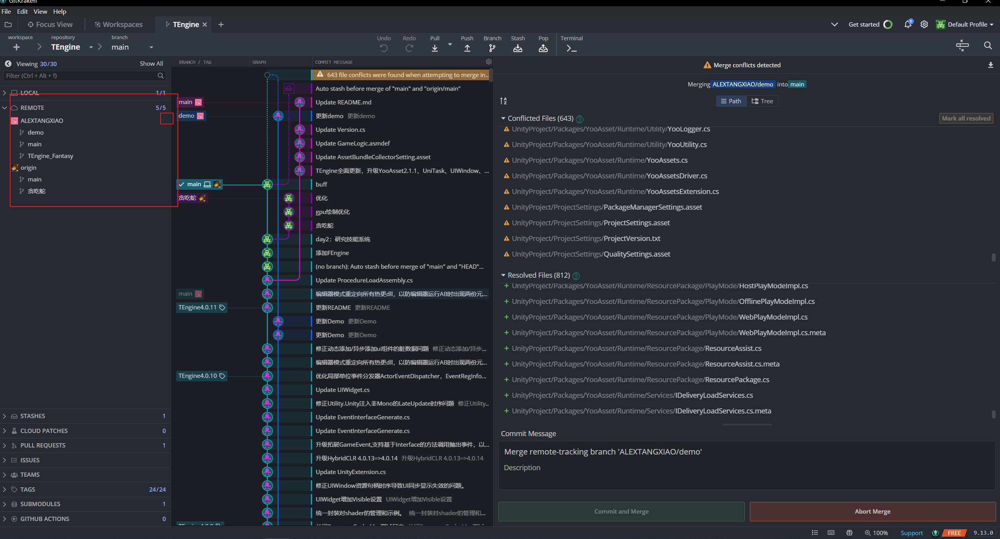

## fork如何更新

## fetch与pull区别

`git fetch` 和 `git pull` 是 Git 中用于获取远程仓库更新的两个命令，它们有一些区别：

1. **git fetch：**
   - `git fetch` 命令会将远程仓库的所有分支、标签等信息都下载到本地，但不会自动合并任何东西到您当前的工作分支。
   - 它会将获取的更新保存到本地仓库的远程跟踪分支（remote tracking branch）中，例如 `origin/main`。
   - 使用 `git fetch` 可以查看远程仓库的最新状态，但不会直接影响您当前的工作区。
2. **git pull：**
   - `git pull` 命令实际上包含了两个操作：`git fetch` 和 `git merge`（或 `git rebase`）。
   - 它会从远程仓库获取最新的提交并自动合并到您当前的工作分支。
   - 如果使用 `git pull` 时存在冲突，Git 会尝试自动解决冲突并进行合并操作。

因此，主要区别在于 `git fetch` 只是获取远程仓库的更新但不会直接合并到当前分支，而 `git pull` 则会获取并合并远程更新到当前分支。选择使用哪个命令取决于您的工作流程和需求：如果您想查看更新并手动决定如何合并，可以使用 `git fetch`；如果您希望自动合并更新到当前分支，可以使用 `git pull`。